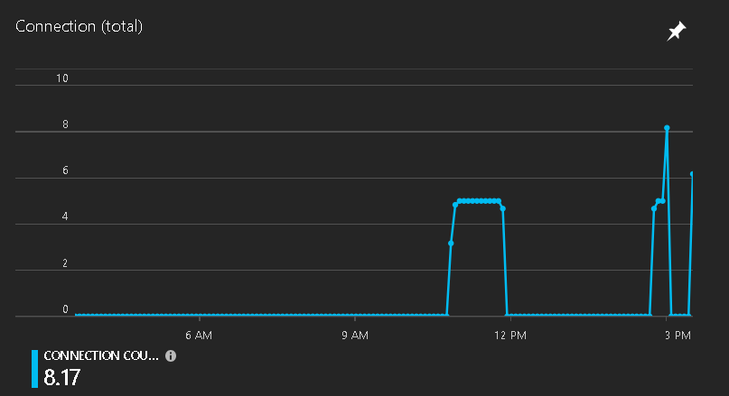
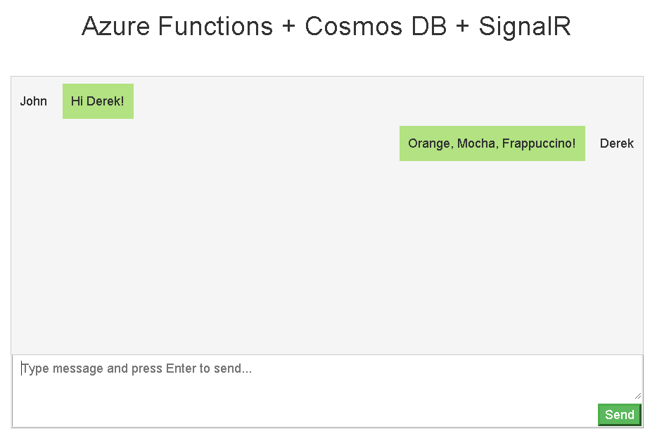
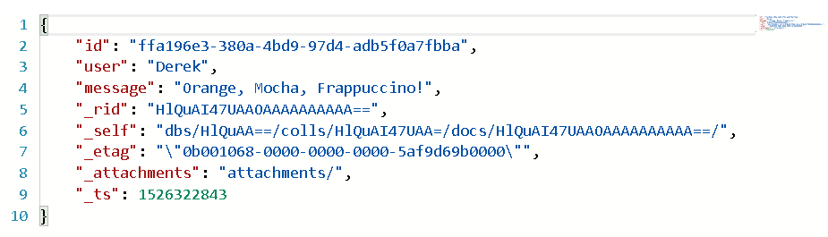
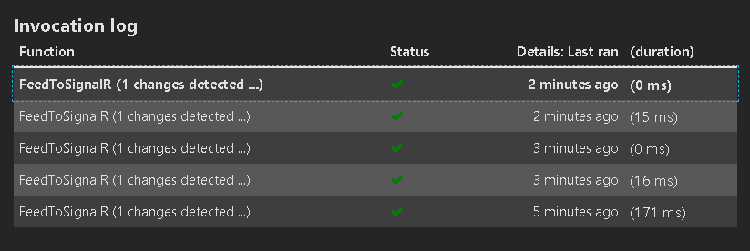

# Serverless notifications with Azure Cosmos DB + Azure Functions + Azure SignalR

This repo contains a reusable solution that creates a complete serverless scenario for a chat application that stores data in [Azure Cosmos DB](https://docs.microsoft.com/azure/cosmos-db/introduction), [Azure Functions](https://azure.microsoft.com/services/functions/) for hosting and event processing and [Azure SignalR](https://docs.microsoft.com/azure/azure-signalr/signalr-overview) for websocket client messaging.

To achieve complete serverless, this solution is using:

* Azure Functions as a [serverless Web host](https://github.com/ealsur/serverlessnotifications/blob/master/src/function/ChangeFeedSignalR/Functions/FileServer.cs) for static html/js/css files (the chat client). 
* Azure Functions [HTTP API](https://github.com/ealsur/serverlessnotifications/blob/master/src/function/ChangeFeedSignalR/Functions/SaveChat.cs) to receive client calls to store data in Azure Cosmos DB using [Output bindings](https://docs.microsoft.com/azure/azure-functions/functions-bindings-cosmosdb#output).
* Azure Functions [CosmosDB Trigger](https://github.com/ealsur/serverlessnotifications/blob/master/src/function/ChangeFeedSignalR/Functions/FeedToSignalR.cs) to send all generated chat lines to Azure SignalR.
* The [web client](https://github.com/ealsur/serverlessnotifications/blob/master/src/function/ChangeFeedSignalR/www/index.html) is using [Azure SignalR's npm package](https://www.npmjs.com/package/@aspnet/signalr) for connectivity and transport protocol resolution.

## How does it work?

The solution will provision one Azure Function App with multiple Functions. 

* [FileServer](https://github.com/ealsur/serverlessnotifications/blob/master/src/function/ChangeFeedSignalR/Functions/FileServer.cs): Acts as a serverless File server for static files that will let a Web client browse and obtain the files in the [www](https://github.com/ealsur/serverlessnotifications/tree/master/src/function/ChangeFeedSignalR/www) folder.
* [SaveChat](https://github.com/ealsur/serverlessnotifications/blob/master/src/function/ChangeFeedSignalR/Functions/SaveChat.cs): Will receive data from the connected Web clients and save it to Azure Cosmos DB.
* [SignalRConfiguration](https://github.com/ealsur/serverlessnotifications/blob/master/src/function/ChangeFeedSignalR/Functions/SignalRConfiguration.cs): Will send the required information to the Web client to initialize SignalR Websocket connection.
* [FeedToSignalR](https://github.com/ealsur/serverlessnotifications/blob/master/src/function/ChangeFeedSignalR/Functions/FeedToSignalR.cs): Will trigger on new data in Azure Cosmos DB and broadcast it through Azure Signal R to all connected clients.

In order to support custom routes (particularly for the static Web host), it implements [Azure Functions Proxies](https://docs.microsoft.com/azure/azure-functions/functions-proxies) through a [proxies.json](https://github.com/ealsur/serverlessnotifications/blob/master/src/function/ChangeFeedSignalR/proxies.json) file. So when browsing the base URL, it is instead calling one of the HTTP triggered Functions.

1. When the Web client loads the static resources, it pulls the SignalR configuration from [SignalRConfiguration](https://github.com/ealsur/serverlessnotifications/blob/master/src/function/ChangeFeedSignalR/Functions/SignalRConfiguration.cs).
2. It will then negotiate with Azure SignalR the best transport protocol.

3. When the user writes a message, it will save it to Azure Cosmos DB via an Ajax call to [SaveChat](https://github.com/ealsur/serverlessnotifications/blob/master/src/function/ChangeFeedSignalR/Functions/SaveChat.cs)

4. Each chat line is stored as a Document in Azure Cosmos DB.

5. The [FeedToSignalR](https://github.com/ealsur/serverlessnotifications/blob/master/src/function/ChangeFeedSignalR/Functions/FeedToSignalR.cs) will trigger and broadcast it to all Azure SignalR connected clients.

This solution does not create any server instance on your subscription, it runs completely on Azure Function's Consumption Plan and consumes Azure Cosmos DB as a serverless database and Azure SignalR as a serverless websocket notification service.

## Requirements

1. Have a pre-existing **Azure Cosmos DB** account to obtain the **Connection String**. REMARKS: the format of the connection string should be "Endpoint=https://{cosmosdb-name}.service.signalr.net;AccessKey={key};".
    1. Create a database called **chat** and a collection called **lines** (it can be the smallest possible 400RU collection).
2. Have a pre-existing **Azure SignalR** account to obtain the **Connection String**.

## How can I use this repo?

### Run it locally

Clone this repo, fill out the [local.settings.json](https://github.com/ealsur/serverlessnotifications/blob/master/src/function/ChangeFeedSignalR/local.settings.json) file with the Connection Strings for Azure Cosmos DB and Azure SignalR and run it with F5!

Open your browser in the base address informed by the Azure Function's runtime (something along the lines of `http://localhost:<some-port>`).

### Deploy it with one click

Just click in the Deploy to **Azure button** and it will guide you into automatically creating the Azure Function app with all the code deployed on Azure.

Open your browser in the base address informed by the Azure Function's Portal (something along the lines of `https://<your-app-name>.azurewebsites.net`).

## Acknowledges

* The web client code was based on Azure SignalR's [official samples repo](https://github.com/aspnet/AzureSignalR-samples/).
* The Azure Function's static web server is based on [@anthonychu's sample](https://github.com/anthonychu/azure-functions-static-file-server).
